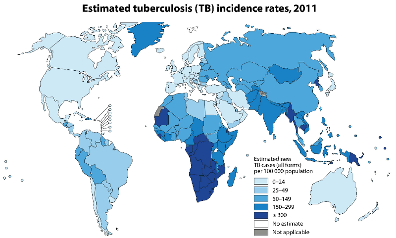
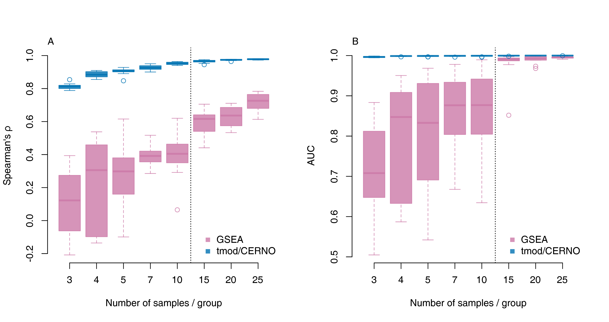
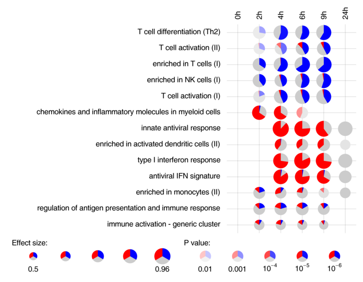
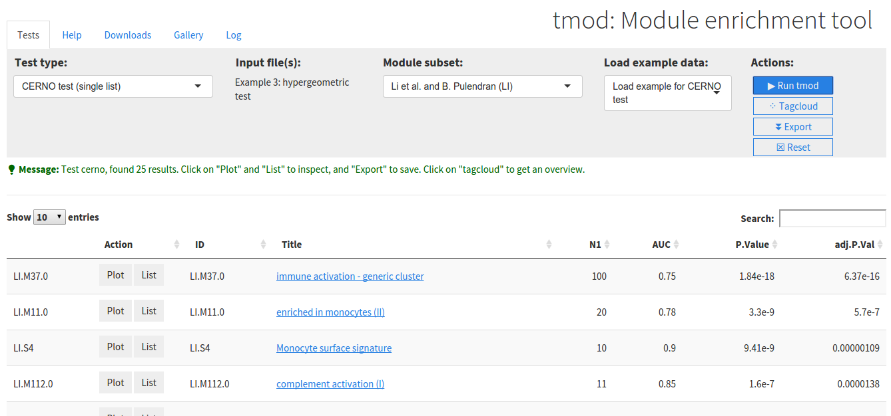

[//]: # ( Setting up the environment )

```{r setup,echo=FALSE,results="hide",include=FALSE}
knitr::opts_chunk$set(echo=TRUE,warning=FALSE,message=FALSE,fig.width=5,fig.height=5,autodep=TRUE)

library(tmod)
library(myfuncs)
library(tagcloud)
library(pca3d)
```


#  What do we work on

## Impact of tuberculosis 



Worldwide 9.6 million new cases and 1.4 million deaths annualy; almost 1/3
of the worlds population may be infected.
 

## We needed a package for enrichment analysis

 * Custom variable sets (expression modules, metabolic profiling)
 * Statistical test(s):
     * not relying on arbitrary thresholds
     * preferably no bootstrapping
     * detached from differential analysis
     * pluggable into ML and MDS (e.g. PCA)
 * Integrating in our R pipelines
 * Highly flexible -- diverse projects with different problem settings 
 * "Bird's eye" visualizations for multiple analyses

##


(xkcd.com/927)

## Introducing tmod

> "Although there is no particular novelty in the methods, the package
> addresses the right questions and appears to do a good job on real
> biological analysis." (Anonymous reviewer) 
       
 -- Perfect!


```{r init,results="hide", echo=FALSE}
options(width=160)
library(tmod)
library(limma)
library(tagcloud)
data(Egambia)
E   <- as.matrix(Egambia[,-c(1:3)])
group <- gsub("\\..*", "", colnames(E))
design <- cbind(Intercept=rep(1, 30), TB=rep(c(0,1), each= 15))
fit <- eBayes( lmFit(E, design))
tt  <- topTable(fit, coef=2, number=Inf, genelist=Egambia[,1:3] )
```

```{r out1, echo=FALSE,include=FALSE}                             
head(tt[ , c("GENE_NAME", "logFC", "P.Value")], 130)
```                                                 


```{r tagcloud, echo=FALSE,include=FALSE}
res <- tmodCERNOtest(tt$GENE_SYMBOL)
w <- -log10(res$P.Value)
c <- smoothPalette(res$AUC, min=0.5, palfunc=colorRampPalette(c("white", "#333333")))
tags <- strmultline(res$Title)
par(bg="#222222")
tagcloud(tags, weights=w, col=c)
```


##  tmod features

 - CERNO: a new(-ish) statistical test for continuous enrichments (Yamaguchi et al. 2008, not implemented elsewhere)
 - MSD: a new method for ordering genes
 - "panel plots" -- visualisation of (serial) gene set enrichment results
 - prepackaged gene sets from Chaussabel et al. (2008) and Li et al. (2014) and metabolic
   profiling clustering from Weiner et al. (2012)
 - facilities for combining multivariate techniques / dimensionality
   reduction techniques / correlation analysis / machine learning with 
   enrichment analysis


<!-- ===================================================================== -->

# CERNO test: a variant of Fisher's exact test

##

Some enrichment tests (such as the hypergeometric test) rely on arbirtrary
tresholds to divide the genes into "differentially expressed" and
"background" (or equivalent sets). It is easy to run a statistical test on
such a setup, however it is problematic: the number of significantly
regulated genes depends on the statistical power, i.e. for example on the
number of samples.

## 

Better tests yet are independent of arbitrary thresholds. Examples include

 * Randomization approaches (such as GSEA)
 * ANOVA-like approaches
 * Mann-Whitney U statistic

However, all methods that we have tested were problematic (eg. too
conservative; too lax). Most importantly, while results were robust for
large sample sets, they were not "down-scalable": results for small sample
sizes rarely reflected the results for large sample sizes.

## CERNO: Ranks can be treated as probabilities

  $$P(rank(g_j) < rank(g_i)) = \frac{rank(g_i)}{N}$$

  Where $N$ is the total number of genes.

## We apply Fisher's method to ranks

  $$\mathbf{CERNO} = -2\cdot \sum_{i=1}^{N}\ln(\frac{rank(g_i)}{N})$$

  The statistics has a $\chi^2$ distribution with $2\cdot N$ degrees of freedom.

##

First, second and third quartiles of number of modules recovered by the
different statistical tests in dependence of the sample size in 100 random sample
replicates.

```{r simula0,cache=TRUE,echo=FALSE,results="hide",warning=FALSE}
Nset <- 2:10
res <- tmodCERNOtest(tt$GENE_SYMBOL[order(tt$adj.P.Val)])

onerepT <- function() {
  sel.a <- c(sample( 1:15, max(Nset)))
  sel.b <- c(sample(16:30, max(Nset)))

  sapply(Nset, function(i) {
    sel <- c(sel.a[1:i], sel.b[1:i])
    e <- E[,sel]
    g <- group[sel]
    d <- cbind(Intercept=rep(1, i*2), TB=rep(c(0,1), each= i))
    f <- eBayes(lmFit(e, d))
    ttmp <- tmodLimmaTopTable(f, coef="TB", genelist=Egambia[,1:3])
    r <- tmodCERNOtest(ttmp$GENE_SYMBOL[order(ttmp$qval.TB)])
    n.cerno <- sum(r$ID %in% res$ID)
    r <- tmodUtest(ttmp$GENE_SYMBOL[order(ttmp$qval.TB)])
    n.u <- sum(r$ID %in% res$ID)
    de <- ttmp$qval.TB < 0.1
    r <- tmodHGtest(ttmp$GENE_SYMBOL[de], ttmp$GENE_SYMBOL)
    n.hg <- sum(r$ID %in% res$ID)
    c(cerno=n.cerno, u=n.u, hg=n.hg)
  })
  }

N <- 100
foo <- sapply(1:N, function(i) { cat(sprintf("\r%d", i)) ; onerepT()} )
cat("\n")

q1 <- sapply(-2:0, function(i) apply(foo[c(1:9)*3 + i,], 1, function(x) quantile(x, 0.25)) )
q2 <- sapply(-2:0, function(i) apply(foo[c(1:9)*3 + i,], 1, function(x) quantile(x, 0.5)) )
q3 <- sapply(-2:0, function(i) apply(foo[c(1:9)*3 + i,], 1, function(x) quantile(x, 0.75)) )
```

```{r simula0b,cache=TRUE,echo=FALSE,results="hide"}
plot(NULL, xlim=c(2,10), ylim=c(0, max(q2)), xlab="Sample size", ylab="Number of modules recovered")
sapply(1:3, function(i) {

  polygon(c(2:10,10:2), c(q1[,i], rev(q3[,i])), col=mypalette(transparent="33")[i], border=NA)
  lines(2:10, q2[,i], col=mypalette()[i], lwd=5)
})

legend("topleft", c( "CERNO", "U test", "HG"), col=mypalette()[1:3], lwd=5, bty="n")


```

<!-- ===================================================================== -->

## Sample size dependent recovery of results for tmod/CERNO and GSEA

[//]: # (Code for generating the figure below available upon request)
[//]: # (This involves running GSEA from R, and long computations)




<!-- ===================================================================== -->

# How to order genes?

## 

 * Order by p-values (common approach). 
     - Genes with strong expression tend to have lower p-values even if
       log-fold changes are small
 * Order by (absolute) log fold change
     - Genes with weak expression (near background) can have huge log fold
       changes despite lack of significance

## 

```{r limma2,fig=TRUE,fig.width=8,fig.height=5,echo=FALSE}
plotCI <- function(x, ci.l, ci.r, title="") {
    n <- length(x)
      plot(x,
          ylab="logFC", xlab="Index",
              pch=19, ylim=c( min(x-ci.l), max(x+ci.r)),
                  main=title)
        segments(1:n, ci.l, 1:n, ci.r, lwd=5, col="#33333333")
}

par(mfrow=c(1,2))

x <- tmodLimmaTopTable(fit, coef="TB")
x <- x[ x$logFC.TB > 0, ] # only to simplify the output!
x2 <- x[ order(abs(x$logFC.TB), decreasing=T),][1:50,]
plotCI(x2$logFC.TB, x2$ciL.TB, x2$ciR.TB, "logFC")

x2 <- x[ order(x$qval.TB),][1:50,]
plotCI(x2$logFC.TB, x2$ciL.TB, x2$ciR.TB, "q-value")

#x2 <- x[ order(x$msd.TB, decreasing=T),][1:50,]
#plotCI(x2$logFC.TB, x2$ciL.TB, x2$ciR.TB, "MSD")
```

## MSD -- Minimal Significant Difference

$$
\text{MSD} = \begin{cases}
CI.L & \text{if logFC} > 0\\
-CI.R & \text{if logFC} < 0\\
\end{cases}
$$

```{r msd2,fig=TRUE,fig.width=12,fig.height=5,echo=FALSE}
par(mfrow=c(1,3))

x <- tmodLimmaTopTable(fit, coef="TB")
x <- x[ x$logFC.TB > 0, ] # only to simplify the output!
x2 <- x[ order(abs(x$logFC.TB), decreasing=T),][1:50,]
plotCI(x2$logFC.TB, x2$ciL.TB, x2$ciR.TB, "logFC")

x2 <- x[ order(x$qval.TB),][1:50,]
plotCI(x2$logFC.TB, x2$ciL.TB, x2$ciR.TB, "q-value")

x2 <- x[ order(x$msd.TB, decreasing=T),][1:50,]
plotCI(x2$logFC.TB, x2$ciL.TB, x2$ciR.TB, "MSD")
```

##

First, second and third quartiles of number of modules recovered by the
different approaches in dependence of the sample size in 100 random sample
replicates.

```{r simula1,cache=TRUE,echo=FALSE,results="hide"}
Nset <- 2:10

onerep <- function() {
  sel.a <- c(sample( 1:15, max(Nset)))
  sel.b <- c(sample(16:30, max(Nset)))

  sapply(Nset, function(i) {
    sel <- c(sel.a[1:i], sel.b[1:i])
    e <- E[,sel]
    g <- group[sel]
    d <- cbind(Intercept=rep(1, i*2), TB=rep(c(0,1), each= i))
    f <- eBayes(lmFit(e, d))
    ttmp <- tmodLimmaTopTable(f, coef="TB", genelist=Egambia[,1:3])
    r <- tmodCERNOtest(ttmp$GENE_SYMBOL[order(ttmp$qval.TB)])
    n.qval <- sum(r$ID %in% res$ID)
    r <- tmodCERNOtest(ttmp$GENE_SYMBOL[order(ttmp$msd.TB, decreasing=TRUE)])
    n.msd <- sum(r$ID %in% res$ID)
    r <- tmodCERNOtest(ttmp$GENE_SYMBOL[order(abs(ttmp$logFC.TB), decreasing=TRUE)])
    n.lfc <- sum(r$ID %in% res$ID)
    c(qval=n.qval, msd=n.msd, lfc=n.lfc)
  })
  }

N <- 100
foo <- sapply(1:N, function(i) onerep())

q1 <- sapply(-2:0, function(i) apply(foo[c(1:9)*3 + i,], 1, function(x) quantile(x, 0.25)) )
q2 <- sapply(-2:0, function(i) apply(foo[c(1:9)*3 + i,], 1, function(x) quantile(x, 0.5)) )
q3 <- sapply(-2:0, function(i) apply(foo[c(1:9)*3 + i,], 1, function(x) quantile(x, 0.75)) )
```

```{r simula2,cache=TRUE,echo=FALSE,results="hide"}
plot(NULL, xlim=c(2,10), ylim=c(0, max(q2)), xlab="Sample size", ylab="Number of modules recovered")

sapply(1:3, function(i) {
  polygon(c(2:10,10:2), c(q1[,i], rev(q3[,i])), col=mypalette(transparent="33")[i], border=NA)
  lines(2:10, q2[,i], col=mypalette()[i], lwd=5)
})


legend("topleft", c( "q-value", "MSD", "logFC"), col=mypalette()[1:3], lwd=5, bty="n")


```

In comparisons with other ordering techniques, MSD has an exceptional
specificity, while maintaining good sensitivity (Joanna Żyła, personal
communication).

<!-- ===================================================================== -->

# Visualisations in tmod

## Basic visualization of enrichment

  In an U-test, the U statistic is (almost) the same as the Area Under
  Curve:

  $$r=1-\frac{2\cdot U}{n_1\cdot n_2} = 1 - 2\cdot\text{AUC}$$

  (r is the effect size for an U-test)

## Basic visualization of enrichment

```{r evidenceplot,fig.width=8,fig.height=6}
evidencePlot(l=tt$GENE_SYMBOL, m="LI.M11.0")
```


## Panel plots showing effect sizes, p-values and direction of change

```{r visual0,echo=FALSE,results="hide",warning=FALSE,cache=TRUE}
data(tbmprof)   ## data from Weiner et al. 2012
data(modmetabo) ## metabolic modules
ids <- rownames(tbmprof)
tb <- factor(gsub("\\..*", "", ids))
sex <- factor( gsub( ".*\\.([MF])\\..*", "\\1", ids))
wcx.tb <- apply(tbmprof, 2, function(x) wilcox.test(x ~ tb, conf.int=T))
wcx.tb <- t(sapply(wcx.tb, function(x) c(x$estimate, x$p.value)))
wcx.sex <- apply(tbmprof, 2, function(x) wilcox.test(x ~ sex, conf.int=T))
wcx.sex <- t(sapply(wcx.sex, function(x) c(x$estimate, x$p.value)))
## limma-like data frame with all results
wcx <- data.frame(ID=colnames(tbmprof),
E.tb=wcx.tb[,1], pval.tb=wcx.tb[,2],
E.sex=wcx.sex[,1], pval.sex=wcx.sex[,2],
row.names=colnames(tbmprof))
ids <- wcx$ID
res <- list()
res$tb <- tmodCERNOtest(ids[order(wcx$pval.tb)], mset=modmetabo)
res$sex <- tmodCERNOtest(ids[order(wcx$pval.sex)], mset=modmetabo)
pie.data <- wcx[,c("E.sex", "E.tb")]
colnames(pie.data) <- c("sex", "tb")
pie <- tmodDecideTests(wcx$ID, lfc=pie.data, lfc.thr=0.2, mset=modmetabo)
```

```{r visual,echo=FALSE,results="hide",warning=FALSE,cache=TRUE,fig.width=10,fig.height=6}
tmodPanelPlot(res, pie=pie, pie.style="rug", grid="between")
```

## A more complex example




# Functional multivariate analysis 

## Multivariate analysis + enrichment = Functional multivariate analysis (FMA)

Combination of multivariate techniques such as PCA and functional
enrichment analysis can circumvent the need for analysis of differential
expression. A primer on FMA will be presented here.

##

```{r pca1,fig.width=16,fig.height=8,echo=FALSE,results="hide"}
group <- gsub("\\..*", "", colnames(E))
pca <- prcomp(t(E), scale.=TRUE)
par(mfrow=c(1,2))
l <- pca2d(pca, group=group, palette=mypalette(), radius=2, components=c(2,1))
legend("topleft", l$groups, col=l$colors, pch=l$shapes, cex=2)
l <- pca2d(pca, group=group, palette=mypalette(), radius=2, components=c(4,3))
legend("bottomright", l$groups, col=l$colors, pch=l$shapes, cex=2)
```

Question in FMA: *What do these components mean?*

## Enrichment in component 4

```{r tmodPCA1,fig.width=9,fig.height=6,echo=FALSE,results="hide",cache=TRUE}
res <- tmodCERNOtest(Egambia$GENE_SYMBOL[ order(abs(pca$rotation[,4]), decreasing=TRUE)])
w <- -log10(res$P.Value)
#c <- smoothPalette(res$AUC, min=0.5, palfunc=colorRampPalette(c("white", "#333333")))
c <- smoothPalette(res$AUC, min=0.5)
tags <- strmultline(res$Title)
#par(bg="#222222")
tagcloud(tags, weights=w, col=c)
```

##

```{r, tmodPCA,fig.width=7,fig.height=7,echo=TRUE,results="hide"}
tmodPCA(pca, 
  genes=Egambia$GENE_SYMBOL, tmodfunc="tmodCERNOtest",
  components=c(4,3), 
  plot.params=list(group=group, palette=mypalette(), radius=2))
```

##

This approach works well also with other multivariate analyses such as
independent component analysis (ICA), partial least squares (PLS) or
correspondance analysis (CA).

Directly combining multivariate analyses with gene set enrichment allows us
to achieve the same results without involving a direct group - to - group
comparison. This makes it especially suitable for exploratory analyses.


## tmod Web Interface 

[http://bioinfo.mpiib-berlin.mpg.de/tmod/](http://bioinfo.mpiib-berlin.mpg.de/tmod/).




<!-- ===================================================================== -->

# Concluding remarks 

## 
 
 * Gene set enrichment analysis is a versatile tool for functional annotation
 * Functional multivariate analysis can replace differential expression analysis
 * *tmod*: R package for BTM and GS enrichment analysis, available from
   [http://bioinfo.mpiib-berlin.mpg.de/tmod/](http://bioinfo.mpiib-berlin.mpg.de/tmod/) and CRAN
 * *tmod* allows functional multivariate analysis and serial enrichment analyiss
 * features several visualization tools
 * Where to find me: MPIIB [january@mpiib-berlin.mpg.de](mailto://january@mpiib-berlin.mpg.de)

## Conributors

 * Teresa Domaszewska (MPIIB) -- co-author (see our poster)
 
We would like to thank Emilio Siena (GSK Vaccines) for new ideas, as well Joanna Żyła, Michał
Marczyk and Joanna Polańska (Politechnika Śląska) for helpful discussions
and the BMBF / InfectControl2020 for supporting Teresa Domaszewska.


<!-- ===================================================================== -->

# Appendix 1: About this presentation

## About this presentation

This is an [Rmarkdown](http://rmarkdown.rstudio.com/) document; you can
view the code on [http://bioinfo.mpiib-berlin.mpg.de/tmod/](http://bioinfo.mpiib-berlin.mpg.de/tmod/)


## 


You can download the source code of this presentation on the tmod web page,
[http://bioinfo.mpiib-berlin.mpg.de/tmod/](http://bioinfo.mpiib-berlin.mpg.de/tmod/).

To recreate this presentation, download the full presentation package and
unzip it. Install the required packages (knitr for R and pandoc). Run the
following command from inside the package archive.
 
Commands:

```{bash,eval=FALSE}
Rscript -e 'knitr::knit("weiner_bioinfo_2015_06_23.Rmd")'
pandoc -s -S -t revealjs weiner_bioinfo_2015_06_23.md -o weiner_bioinfo_2015_06_23.html \
  --mathjax='http://cdn.mathjax.org/mathjax/latest/MathJax.js?config=TeX-AMS-MML_HTMLorMML' \
  --css css/mytheme.css \
  --slide-level 2 -V theme=blood
```

(Note: for an offline version, download MathJax and modify the --mathjax option)

##

To extract the code from this presentation, save it as "test.Rmd" and run

```{bash, eval=FALSE}
Rscript -e 'knitr::purl("tmod.Rmd")'
```

## Printing:

This only works properly in Google Chromium; see [reveal.js documentation](https://github.com/hakimel/reveal.js#pdf-export)

To print, follow the link below and press Ctrl-P; don't worry if the slides
appear to overlap -- they will look fine on the print preview.

[Print](?print-pdf)


<!-- ===================================================================== -->

# Appendix 2: Serial analysis of enrichment with *[tmod](http://bioinfo.mpiib-berlin.mpg.de/tmod/)*

## 

*tmod* has been designed as a package for testing the enrichment of blood
transcriptional modules. Therefore, *tmod* contains two sets of blood
transcriptional module definitions; however, it can be used with any
arbitrary gene set definition (e.g. GSEA/MSigDB) or high throughput data
type (e.g. metabolomics)

*tmod* implements HG / U / CERNO tests, functional
multivariate analyses, serial analysis / visualization and more.

Availability: [http://bioinfo.mpiib-berlin.mpg.de/tmod/](http://bioinfo.mpiib-berlin.mpg.de/tmod/)


## Example: MFA with R and tmod

Data set Egambia: GEO [GSE28623](http://www.ncbi.nlm.nih.gov/geo/query/acc.cgi?acc=GSE28623).

```{r tmodEx10}
library(tmod)
data(Egambia)
head(Egambia)
```

##

```{r tmodEx11}
pca <- prcomp(t(Egambia[,-c(1:3)]), scale.=TRUE)
names(pca)
head(pca$x[,1:5])
```

## 

```{r tmodEx20}
head(pca$rotation[,1:5])
```

## Enrichment for each component

```{r tmodEx30}
l <- Egambia$GENE_SYMBOL
encfunc <- function(r) {
  o <- order(abs(r), decreasing=TRUE)
  tmodCERNOtest(l[o])
}
res <- apply(pca$rotation[,1:10], 2, encfunc)
head(res[[4]])
```

## Visualization 

```{r tmodEx40,fig.width=10,fig.height=7}
tmodPanelPlot(res, filter.empty.rows=TRUE)
```

## Genes with positive / negative weights?

```{r tmodEx50,fig.width=10,fig.height=6,cache=TRUE}
qfnc <- function(r) quantile(r, 0.75)
qqs <- apply(pca$rotation[,1:10], 2, qfnc)
pie <- tmodDecideTests(l, lfc=pca$rotation[,1:10], lfc.thr=qqs)
tmodPanelPlot(res, pie=pie, pie.style="rug", grid="between")
```

# Appendix 3: MFA

## Functional Principal Component Analysis (PCA)

In PCA, the $N \times K$ matrix $\mathbf{X}$ of $N$ samples and $K$ variables (e.g.
genes) is rotated, which results in a new matrix, $\mathbf{Y}$, with $N$ samples and
$J$ principal components (PCs).

Effectively, a $K \times J$ matrix $\mathbf{W}$ is calculated, such that

$$ \mathbf{X}\times \mathbf{W} = \mathbf{Y} $$

##

$$ \mathbf{X}\times \mathbf{W} = \mathbf{Y} $$

Each column of $\mathbf{X}$ is a principal component. Each row corresponds
to one sample.

A value for a given PC $j$ and a given sample $n$ is calculated as

$$ y_{n,j} = \sum_{k=1}^{K} w_{j,k}\cdot x_{k,n} $$

The terms $w_{j,k}$ are variable- (or: gene-) specific *weights* or
*loadings* for each component $j$. 

##

$$ y_{(n,j)} = \sum_{k=1}^{K} w_{k,j}\cdot x_{k,n} $$

The larger the absolute value of $w_{k,j}$, the more impact this gene has
on the $j$-th principal component.

We can sort the genes by their weight in a component. Since as a result we
get a sorted list of genes, we can apply a continuous enrichment algorithm.


